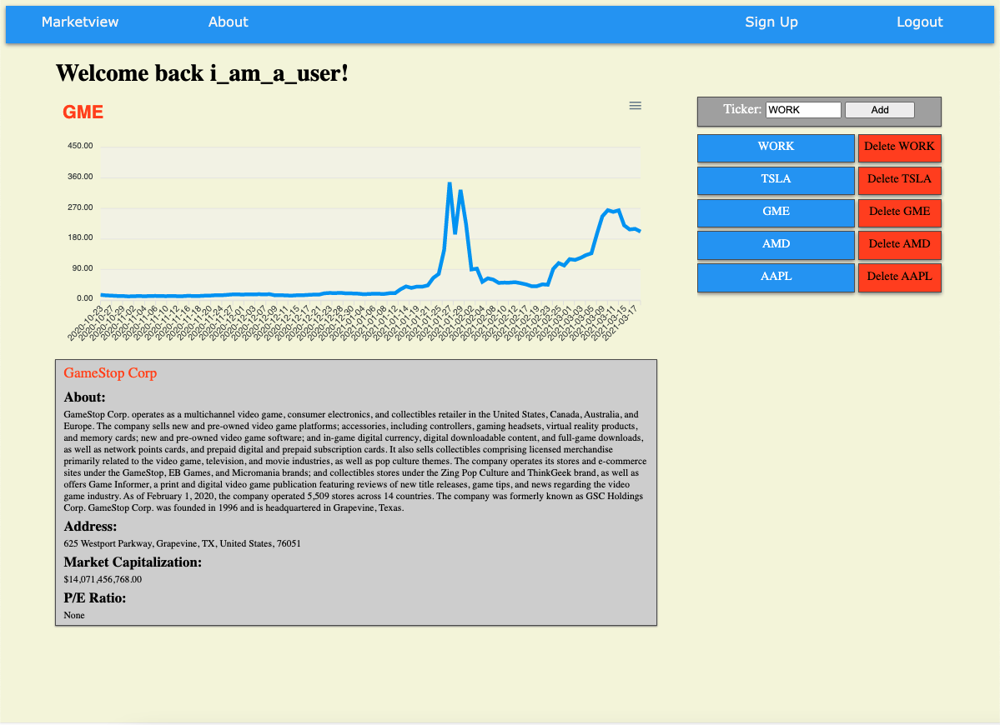

# marketview

**Open the App here:** https://marketview-app.herokuapp.com/

A full-stack web application with user generation, allowing users to create a portfolio of stocks to track. The stock data is fetched via an API and charted on the webpage. I utilized vanilla JavaScript, MondDB, Node.js and Express to create this app. 

### Running the code
 - git clone https://github.com/anthony-rk/marketview.git 
 - npm install
 - npm run start
 - Open localhost:3000 

**Technologies used:** HTML, CSS, JavaScript (ES6), MongoDB, Node.js, express, NPM, GitHub CLI, Heroku CLI
